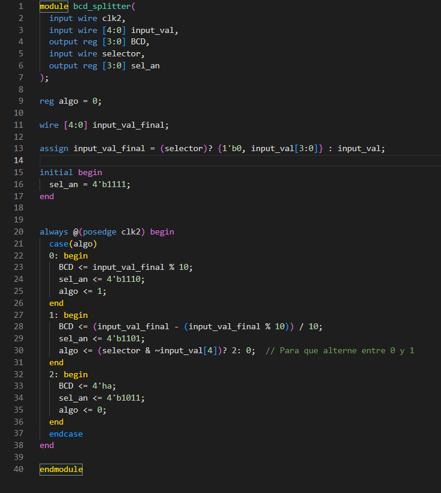
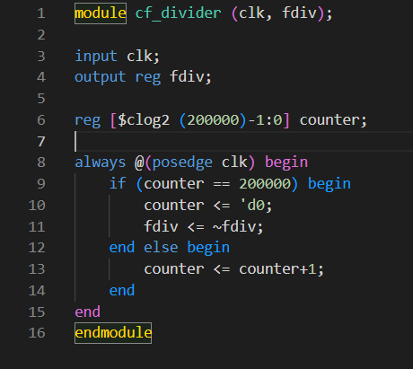

<h1> Lab03: Decodificador BCD a 7segmentos</h1>

<h2> Integrantes </h2>
<ol>
<li>Óscar Moreno</li>
<li>Ángel Jiménez</li>
<li>Jonathan Godoy</li>
</ol>

<h2> Informe </h2>

<h2>Índice:</h2>

1. [Diseño implementado](#1-diseño-implementado)
2. [Simulaciones](#2-descripción)
3. [Implementación](#3-diagramas)
4. [Simulaciones](#4-simulaciones)
5. [Implementación](#5-implementación)
6. [Conclusiones](#conclusiones)

<h2>1. Diseño implementado</h2>

El diseño implementado en la realización de la práctica debía cumplir el seguimiento establecido dado en la guía de laboratorio de la Práctica 3, la interacción con los displays de 7 segmentos dispuestos en la parte centro-superior de la tarjeta reprogramable Cyclone IV.

La práctica se dividió en 3 partes: Plug & Play, Ánodo Común y la implementación con un divisor de frecuencia y un selector de alternado para los displays.

<h3>2. Descripción</h3>
<h4><b>Primera Parte: Plug & Play</b></h4>

La primera parte referida como Plug & Play, se determinaba a partir del código preliminar proporcionado por la docente, en el cual, en un solo display  de 7 segmentos se realizara la representación de cualquier número desde el 0 hasta el 15, de acuerdo a las diferentes combinaciones de un conjunto de dip switches o banco de interruptores DIP <i>Dual In-Line Package</i>. 

Los números del 10 al 15 serán representados por letras mayúsculas en los displays, de la A hasta la F. En este caso, solo uno de los displays debe activarse y cambiar de acuerdo al orden de los interruptores, con la debida asignación de pines de acuerdo a lo consignado en la Cyclone IV.

En concordancia con lo dispuesto en la guía, lo que se buscaba era la realización de esta secuencia de la implmentación, entendido desde la siguiente imagen:

<h4>Segunda Parte: Ánodo Común</h4>

Con respecto a la parte del <i>Ánodo Común</i> lo que se buscaba era que 4 displays de 7 segmentos compartieran el mismo dígito colocado de acuerdo a la combinación del banco de interruptores. Estos, al igual que en la primera parte, correspondían a las diferentes combinaciones presentes. Mientras que 4 interruptores fueron asignados para el encendido y el apagado de su respectivo display, los otros 4 realizaban la combinaciónpara efectuar el número requerido.

Según la guía de laboratorio, el ánodo común se correspondía a la siguiente imagen:

<h4>Tercera Parte: Representación de Números Grandes</h4>

La tercera y última parte del laboratorio de interacción en el uso con los displays de 7 segmentos consistió en la representación de un número con unidades, decenas y hasta centenas de acuerdo a la combinación presente en el banco de interruptores. Esto se lograba aplicando la lógica consignada en la siguiente imagen:

En la última imagen consignada, se encuentra la representación de la lógica a aplicar en la práctica de laboratorio, en la que por medio de su implementación, sería posible representar hasta el número 255 en los displays de 7 segmentos. Estos, al ser números de 8 bits, requerían necesario la instalación temporal de bancos de interruptores adicionales para que la cantidad fuese suiciente. Estos bancos de interruptores DIP adicionales debían ser instalados por medio de una placa protoboard, conectados a un grupo de pines de propósito general de la Cyclone IV, para poder efectuar su asignación.

<h2>3. Diagramas</h2>

De los códigos, hay un grupo de módulos que se crearon para la implmentación de las tres partes en la Cyclone IV. Se partió desde el código de 7 segmentos original, un módulo de BCD conjunto con una entrada de la señal de <i>CLOCK</i>, los módulos estructurales del sumador de 1 bit y 4 bits, un divisor de frecuencia y un módulo principal para las respectivas instancias que deban hacerse.

Se presentarán a continuación los diferentes módulos incluidos en la práctica para hacer posible implementación de la práctica:

<h6>Módulo BCDtoSSeg (Módulo principal para los displays de 7 segmentos):</h6>

<h6>Módulo BCDtoSSeg_mod (Módulo de interacción y separación de displays):</h6>

<h6>Módulos Sumadores de 1 y 4 bits:</h6>

<h6>Módulo freq.div (Módulo de acoplamiento para la señal de clock):</h6>

<h6>Módulo top (Módulo principal para instanciamiento de módulos adicionales):</h6>

<h2>4. Simulaciones</h2>

Para la simulación de la práctica, se utilizó el programa Icarus Verilog para determinar la correlación de los diagramas temporales de las variables de estudio. A continuación, se presentará la simulación del análisis de algunas de laas variables de estudio en la instanciación del módulo principal para la implementación de la práctica en la Cyclone IV:

<h2>5. Implementación</h2>

Para la implementación en la Cyclone IV se logró realizar las dos primeras partes con éxito, logrando realizar la conexión de un solo displays, y luego la conexión a ánodo común para la conexión de 4 displays. La tercera parte, en la separación de unidades decenas y centenas, se logró realizar la práctica hasta la separación de decenas y unidades, pero con la particularidad 

<h2>6. Conclusiones</h2>

